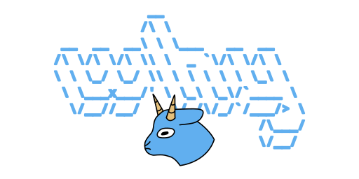

# (wh)y lang

## language example

### variables

**types:**

- string
- number
- boolean
- function

```
a = 0;
b = "str";
c = true;
test = fn x: num, y: str, z: bool -> str {
  "num:" + x + " str:" + y + " bool:" + z
};
```

### statments

- if

```
a = 20;

if a == 0 {

} else if a == 10 {

} else {

}
```

- is

```
a = 20;

a is {
  > 6 -> it * 10,
  : num -> "num: " + it
}
```

### types

```
def Result = str | num;
```

### functions

- **fn arg: type -> return type**
- **fn arg: (fn arg: type -> return type) -> return type**

```
test = fn x: num, y: str, z: bool -> str {
  "num:" + x + " str:" + y + " bool:" + z
};

wrapper = fn inner: (fn a: num -> num) -> num {
  inner(20)
};

wrapper({
  a * 4
})
```
